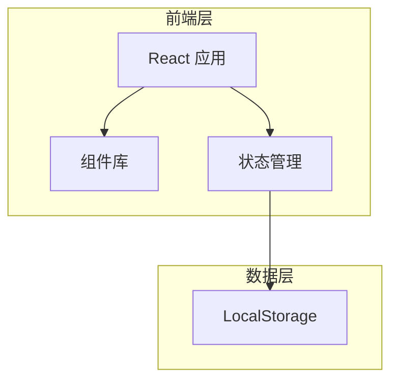
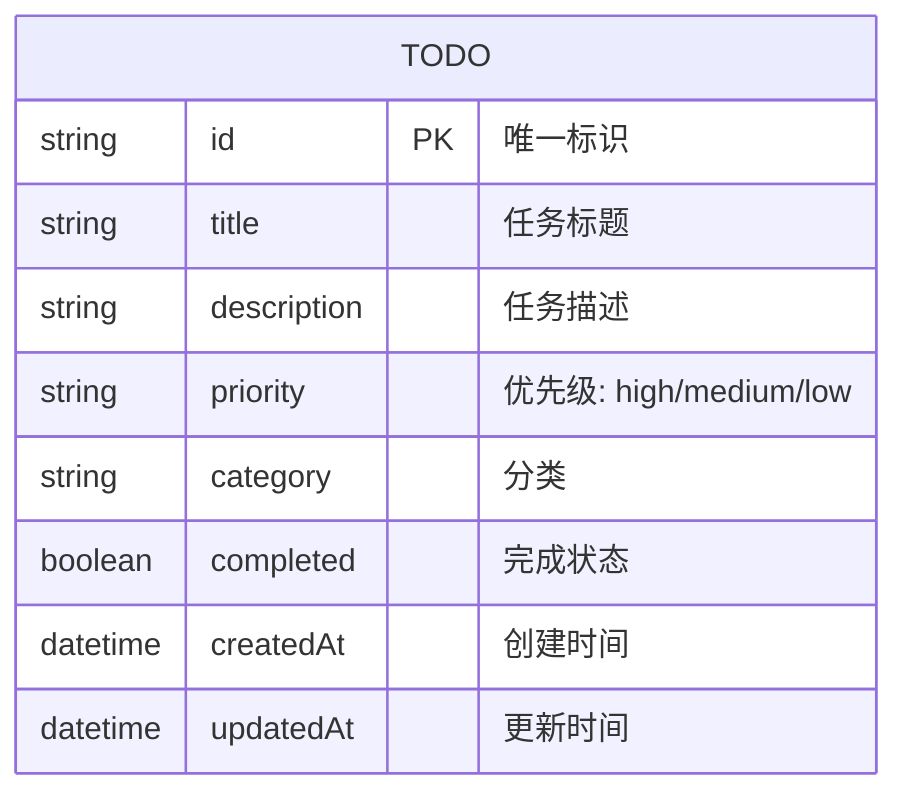

## 1. 架构设计



## 2. 技术说明

- **前端**: React@18 + TypeScript + Tailwind CSS@3 + Vite
- **初始化工具**: Vite (react-ts 模板)
- **后端**: 无 (纯前端应用)
- **数据存储**: LocalStorage (浏览器本地存储)
- **动画**: CSS Transitions + Keyframes

## 3. 路由定义

| 路由 | 用途 |
|-----|------|
| / | 主页面 - 任务列表和所有操作 |

## 4. 数据模型

### 4.1 数据模型定义



### 4.2 数据结构定义

```typescript
type Priority = 'high' | 'medium' | 'low';

interface Todo {
  id: string;
  title: string;
  description: string;
  priority: Priority;
  category: string;
  completed: boolean;
  createdAt: string;
  updatedAt: string;
}

interface FilterState {
  status: 'all' | 'active' | 'completed';
  priority: Priority | 'all';
}
```

## 5. 组件结构

```
src/
├── components/
│   ├── TodoInput.tsx       # 任务输入组件
│   ├── TodoList.tsx        # 任务列表组件
│   ├── TodoItem.tsx        # 单个任务项组件
│   ├── TodoFilter.tsx      # 筛选组件
│   ├── TodoStats.tsx       # 统计组件
│   └── TodoModal.tsx       # 编辑弹窗组件
├── hooks/
│   └── useTodos.ts         # 任务管理 Hook
├── types/
│   └── todo.ts             # 类型定义
├── utils/
│   └── storage.ts          # LocalStorage 工具
├── App.tsx                 # 主应用组件
├── main.tsx                # 入口文件
└── index.css               # 全局样式
```

## 6. 核心功能实现

### 6.1 状态管理

使用 React useState + useLocalStorage Hook 管理任务状态，无需引入额外状态管理库。

### 6.2 数据持久化

通过 LocalStorage 实现数据持久化，页面刷新后数据不丢失。

### 6.3 动画效果

使用 CSS transitions 和 keyframes 实现流畅的交互动画。
