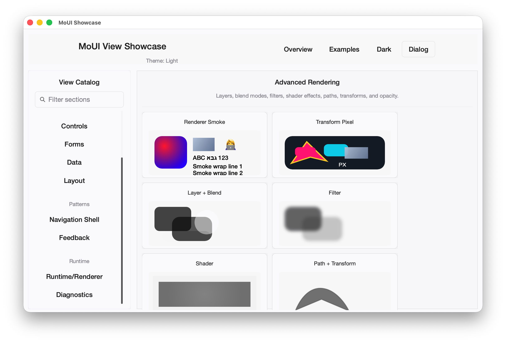
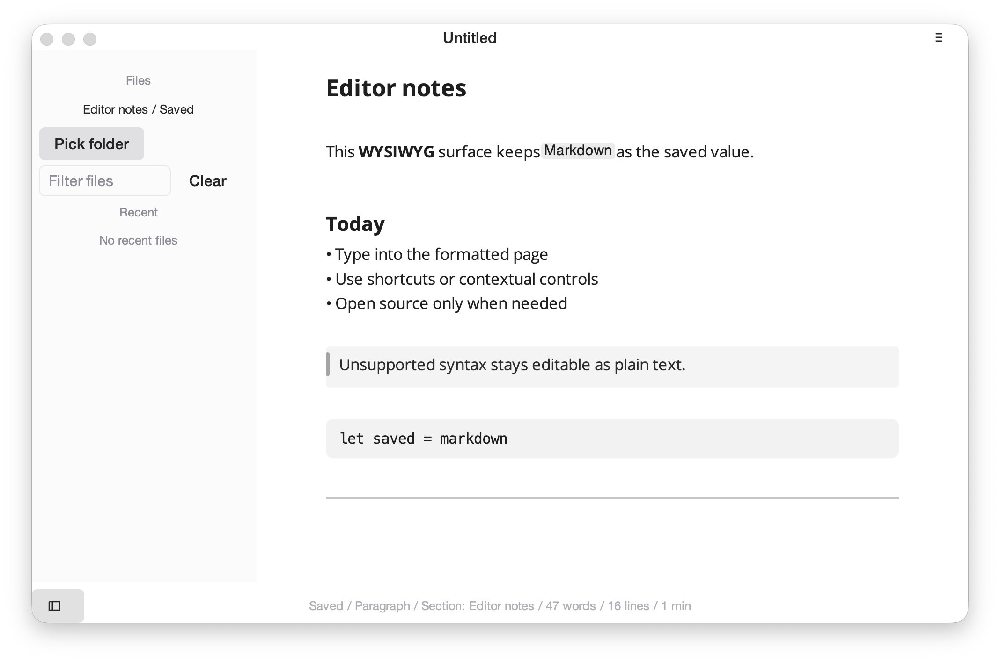
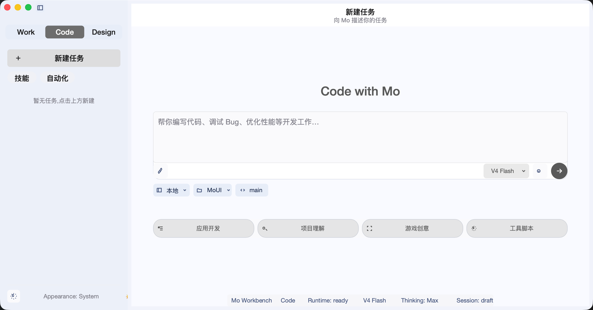
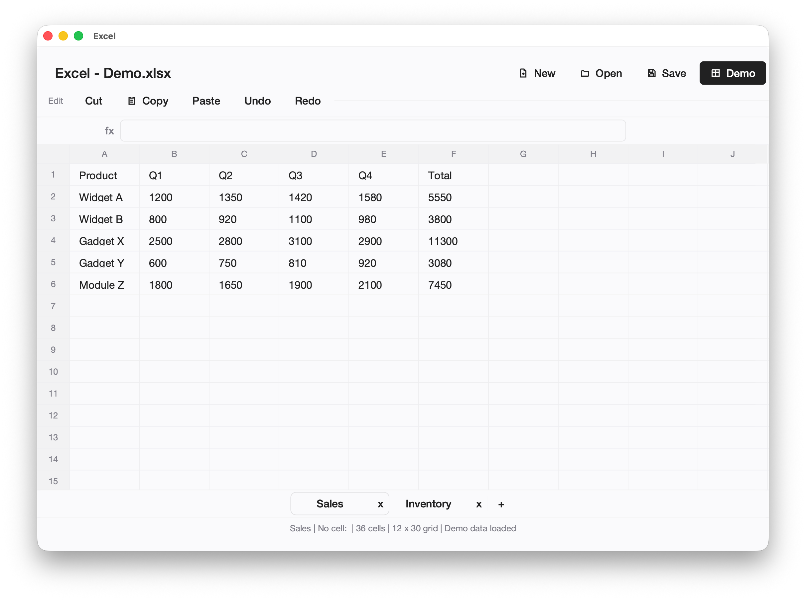
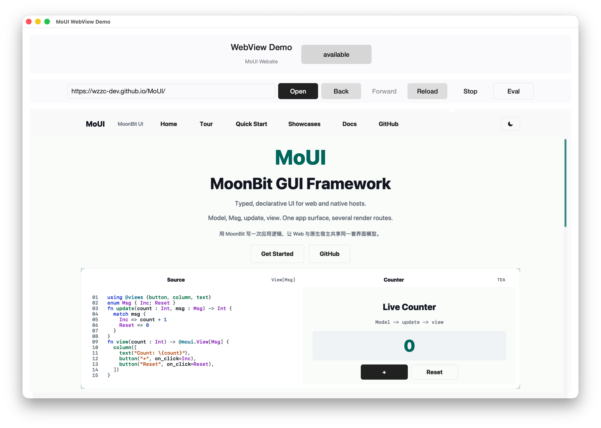
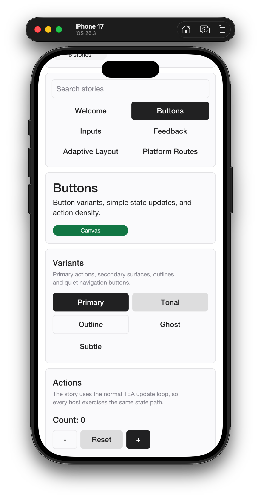
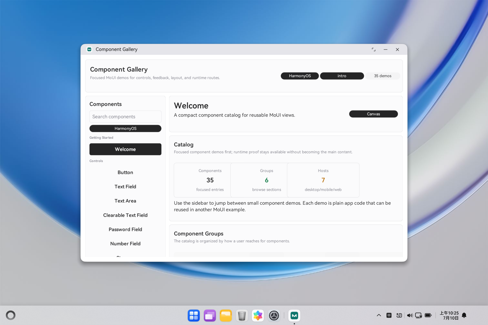
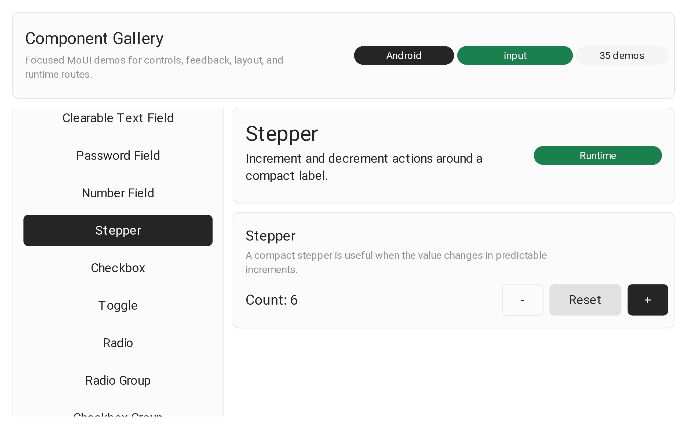

<div align="center">
  
  <h1>MoUI</h1>
  <p>多平台 MoonBit 声明式 GUI 框架 — 使用共享的平台无关应用逻辑构建声明式 UI 应用</p>
  <p>
    简体中文 | <a href="./README.md">English</a>
  </p>
  <p>
    <a href="./LICENSE"></a>
    <a href="https://github.com/wzzc-dev/MoUI"></a>
  </p>
  <p>
    <a href="https://gitcode.com/wzzc/MoUI"></a>
  </p>

  <p>
    <a href="#快速开始">快速开始</a> ·
    <a href="#项目结构">项目结构</a> ·
    <a href="#运行示例">运行示例</a> ·
    <a href="#文档">文档</a> ·
    <a href="#贡献">贡献</a>
  </p>
</div>

---

MoUI 是一个多平台 MoonBit GUI 框架，用于构建声明式 UI 应用，共享平台无关的应用逻辑。原生宿主核心拥有窗口、事件、服务和生命周期，再通过平台渲染器提供方包（renderer provider packages）接入具体的渲染器。

欢迎贡献 — 请参阅 [CONTRIBUTING.md](CONTRIBUTING.md)。

当前主线为原生 Skia 光栅化 + Web `wasm-gc + window/web + 浏览器 WebGPU host imports` 路径。原生 WGPU 仍作为实验性诊断路径保留，等待 MoonBit WGPU 生态进一步成熟。

### 支持平台（产品形态）

| 平台 | 形态 | 说明 |
| --- | --- | --- |
| macOS | **committed** | 产品主线（L0–L3 证据完备） |
| Web | **committed** | 产品主线（wasm-gc + WebGPU） |
| Windows | **committed_with_gaps** | 产品 L0–L2；完整 L3 运行时仍部分缺口 |
| Linux | **committed_with_gaps** | 产品 L0–L2；交互式 L3 仍部分缺口 |
| Android | **experimental** | Window 托管路径可编译；暂无可用性/产品承诺 |
| iOS | **experimental** | 同 Android |
| HarmonyOS | **experimental** | 同上；已签名真机的完整 smoke 仍待补齐 |

> 移动端**不是**“仅胶水代码”，也**不是**产品级已承诺形态，而是 **experimental**：代码可编译、宿主模拟测试可通过，但在提供真机匹配证据前，不对开发/演示可用性或产品承诺做保证。详见[平台就绪声明](docs/platform-readiness-declaration.md)。

运行时管线是显式的：

```text
View[Msg] -> ElementTree -> LayoutTree -> RenderTree -> DrawCommand -> renderer
```

## 项目结构

- `moui/core/` 拥有平台无关的契约、不透明 `View`、类型化事件、`Program`、`Effect`、`Subscription`、几何、绘制、语义，以及被类型化 `View[Msg]` 包装的、与消息无关的公共 `ViewNode` 扩展协议。
- `moui/views/` 拥有公共视图构造器和具体控件行为，以 `@core.ViewNode` 值实现，并通过 `@core.View::from_node` 构造，不新增 `core` 枚举变体。
- `moui/runtime/` 对外暴露应用/宿主 `AppRuntime` 构造入口，并拥有运行时状态、树/布局/绘制、事件分发、程序消息排空、effect 任务、subscription 生命周期和诊断。
- `moui/views/` 为应用代码返回面向应用的 `@moui.View[Msg]` 值。
- `moui/backend/` 定义共享宿主契约；平台后端将窗口与输入事件归一化为 `Event`。
- `moui/backend/<platform>/` 仅拥有中立宿主；应用在组合根（composition root）中选择 `moui_skia_renderer` 或其他渲染器提供方。
- `moui/render/` 提供渲染器门面，原生 Skia 光栅、WebGPU 适配器以及实验性原生 WGPU 实现分别位于 `moui_skia_renderer/`、`moui_web_renderer/` 和 `moui_wgpu_renderer/`。
- `moui_theme/` 是可选的附加 workspace 成员，提供带源码映射的 Material、Carbon、Primer、Fluent 主题预览，以及首个自研的 Smartisan 风格 Sickle 拟物/扁平混合主题。
- `examples/*/app/` 包含共享的应用逻辑，平台子包为轻量入口。
- `website/` 为 MoUI 官网与 Web 演示站点。

## 截图

<div align="center">

  
  

  <br/><br/>

  
  

  <br/><br/>

  
  

  <br/><br/>

  
  

</div>

## 快速开始

选择与你的目标匹配的路径。

### Playground 在线体验

打开 [浏览器 Playground](https://wzzc-dev.github.io/MoUI/playground/)，无需安装原生工具链即可在线编辑和运行引导示例。这是最短的学习 `view/update` 模型与验证 Web 行为的路径。

### 独立项目

安装独立 CLI，然后在仓库外生成新项目：

```sh
moon install wzzc-dev/moui_cli/cmd/moui
moui new my_app
# 更小的骨架： moui new my_app --template hello
cd my_app
moon update
moon check
moon run macos_skia --target native   # 或在对应宿主上使用 windows_skia / linux_skia
```

`moui new` 会创建共享应用逻辑 + Web 与当前桌面端入口。如需 Android、iOS 或 HarmonyOS，请显式添加 `--platform`；移动端项目使用 `wzzc-dev/window` 模板，并将生命周期、surface 与输入保留在平台事件循环中。详见[快速上手](docs/getting-started.md)。

### 本仓库开发

当你需要修改 MoUI 本身或运行完整功能示例时，使用此路径：

```sh
git clone --recurse-submodules https://github.com/wzzc-dev/MoUI.git
cd MoUI
sh scripts/ci-moon-update.sh
sh scripts/check.sh --profile pr
moon test examples/showcase/app --target native
moon test examples/markdown_editor/app --target native
```

国内用户也可通过 GitCode 镜像获取代码：

```sh
git clone https://gitcode.com/wzzc/MoUI.git
```

Showcase 与 Markdown Editor 是主要的扫描与交互示例，其平台入口列于[运行示例](#运行示例)。

框架安装细节（包括可选子模块与 `window/` 本地源码工作流）见 [Development](docs/development.md)。

默认的 daily 基线覆盖核心框架、维护基线棘轮、Web wasm-gc、原生 Skia 主线契约、Showcase 与 Markdown Editor。Design Systems 为附加诊断覆盖；当改动 `moui_theme` 或 `examples/design_systems` 时请运行 `sh scripts/check.sh --profile theme`。

当前宿主的后端/提供方检查：

```sh
sh scripts/check.sh --profile platform
```

面向发布的截图与基准交接：

```sh
node scripts/conformance-capture-scaffold.mjs --mode golden
node scripts/conformance-capture-scaffold.mjs --mode benchmark
```

这些命令会在 `artifacts/` 下生成本地脚手架清单与日志；发布说明应引用相关的 CI 运行、已上传产物或 smoke 日志，而非提交生成产物。`artifacts/` 已被忽略，请将其作为本地或 CI 证据保留。

## 运行示例

精选示例 — `showcase`、`markdown_editor`、`mo_workbench` 和 `excel` — 在 `examples/<name>/app` 中共享应用逻辑，并暴露轻量平台入口。Showcase 拥有 `web_wasm`、桌面端渲染器专属入口，以及 `android_window_hosted`、`ios_window_hosted` 和 `harmonyos_window_hosted` 移动端入口。

如需在移动端尝试 Showcase，请按对应平台的安装、构建与运行说明操作：
[Android](docs/android-support.md)、[iOS](docs/ios-support.md) 或 [HarmonyOS](docs/harmonyos-support.md)。标准示例通过 `moui build` 使用匹配的 `wzzc-dev/window` 平台模板。

> **Windows 前置条件：** 在构建或运行任何 Windows 原生 Skia 入口（`windows_skia`）前，请在 PowerShell 会话中初始化 MSVC 工具链：
>
> ```powershell
> .\scripts\windows\msvc_env.ps1
> ```
>
> 该脚本会为原生 Skia 链接步骤配置 MSVC 环境。在 Windows 上执行 `moon run ... --target native` 之前，每个 shell 需运行一次。

### Showcase

横跨桌面、移动与 Web 的统一 Components、Patterns、Platform 与 Diagnostics 工作区。源码位于 `examples/showcase/app`，平台入口保持轻量。

```sh
# Web (wasm-gc)
moon build examples/showcase/web_wasm --target wasm-gc

# macOS Skia
moon run examples/showcase/macos_skia --target native

# Windows Skia（先在 PowerShell 中运行 msvc_env.ps1）
.\scripts\windows\msvc_env.ps1
moon run examples/showcase/windows_skia --target native

# Linux Skia
moon run examples/showcase/linux_skia --target native
```

### Markdown Editor

所见即所得的类 Typora Markdown 编辑器。源码位于 `examples/markdown_editor/app`，保留的 macOS/Web 入口保持轻量。

```sh
# Web (wasm-gc)
moon build examples/markdown_editor/web_wasm --target wasm-gc

# macOS Skia
moon run examples/markdown_editor/macos_skia --target native
```

### Mo Workbench

以原生 Skia 为先的桌面端 Agent 内部产品。当前仅接入 `macos_skia`；Linux/Windows/Web 入口已预留。`bobzhang/openseek` 依赖从 mooncakes.io 解析（在 `examples/mo_workbench/moon.mod` 中已 pin）；无需子模块或 workspace 成员覆盖。

```sh
moon run examples/mo_workbench/macos_skia --target native
```

### Excel Viewer

基于 MoonBit Excel（`bobzhang/mbtexcel`）文件的渲染器，使用 MoUI 数据表组件。共享应用逻辑位于 `examples/excel/app`，保留 `macos_skia` 入口。

```sh
# macOS Skia
moon run examples/excel/macos_skia --target native
```

精选示例的应用包聚焦测试：

```sh
moon test examples/markdown_editor/app --target native
moon test examples/mo_workbench/app --target native
moon test examples/showcase/app --target native
moon test examples/excel/app --target native
```

包形态与平台覆盖详见 [Showcase](examples/showcase/README.mbt.md)、[Examples](docs/examples.md)、[Markdown Editor](docs/markdown-editor.md)、[Mo Workbench](docs/mo-workbench.md) 与 [Showcases](docs/showcases.md)。

## 文档

源码文档位于 `docs/`。网站预览通过 `node scripts/sync-website-docs.mjs` 将这些 Markdown 文件复制到 `website/web_wasm/docs/`。

- [Architecture](docs/architecture.md)
- [Development](docs/development.md)
- [Testing](docs/testing.md)
- [API surface](docs/api-surface.md)
- [API surface audit](docs/api-surface-audit.md)
- [Maintenance mainline](docs/maintenance.md)
- [Platform notes](docs/platform-notes.md)
- [Renderer capability report](docs/renderer-capability-report.md)
- [View catalog](docs/view-catalog.md)
- [Views API guide](docs/views-api-guide.md)
- [Non-render component cookbook](docs/non-render-component-cookbook.md)
- [App templates](docs/app-templates.md)
- [Examples](docs/examples.md)
- [Markdown Editor](docs/markdown-editor.md)
- [Mo Workbench](docs/mo-workbench.md)
- [AI collaboration](docs/ai-collaboration.md)
- [2026 roadmap](docs/roadmap-2026.md)
- [Release readiness](docs/release-readiness.md)

## 贡献

MoUI 由单一维护者借助 AI 协助维护，对外部贡献持开放态度。Pull Request 是变更的主要入口。

- [贡献指南](CONTRIBUTING.md) — 环境搭建、包边界、PR 要求、DCO
- [治理](GOVERNANCE.md) — 决策机制、RFC 流程、维护者角色、项目交接
- [安全策略](SECURITY.md) — 漏洞上报与支持范围
- [行为准则](CODE_OF_CONDUCT.md)

## 许可证

Apache-2.0。详见 [LICENSE](LICENSE)。

第三方依赖与归属说明汇总于 [THIRD_PARTY.md](THIRD_PARTY.md)。
